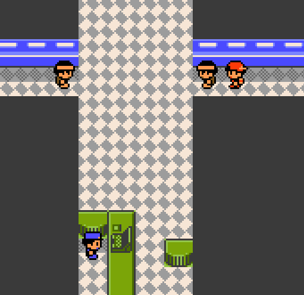

# Project Celebi

**Carry your Pokémon Red, Blue, or Yellow trainer into Pokémon Gold as a veteran — not as a brand-new kid starting over.**

Project Celebi is a Gen1Recomp mod that turns Gold into something closer to an **expansion pack for your existing Gen 1 save**. It creates a fresh native Gold world, then carries forward the parts of your Gen 1 history that should logically still belong to your trainer: your Pokémon, Pokédex progress, money, compatible possessions, Kanto accomplishments, travel history, and field-move access.

> [!IMPORTANT]
> ## Public Beta: gameplay continuity first, narrative rewrite later
> This release focuses on **save continuity, progression, balance, and making Johto playable with a veteran Gen 1 team**.
>
> **Dialogue changes and immersion work are minimal in this version.** Most Gold NPC dialogue and story text is still vanilla. Characters may occasionally speak to your imported Champion as though they are a new trainer, and some scenes will have narrative inconsistencies with the fact that you already completed a Gen 1 adventure.
>
> A future pass can rewrite dialogue and add more bespoke Project Celebi-specific story flavor. For this beta, expect the gameplay to understand your history better than the script does.



##Getting Started: 

Starting Project Celebi only takes a few steps:

Begin a new Pokémon Gold save and choose a starter.
Project Celebi needs Gold's normal opening sequence to initialize the save before your Gen 1 data can be imported.
Open the START menu.
Select CELEBI.
Choose the Pokémon Red, Blue, or Yellow save file you want to continue from.
Confirm the import.

That's it. Your Gen 1 trainer and Legacy data will be brought into Pokémon Gold, and you're free to continue into Johto.

## What Project Celebi does

### Continue your Gen 1 trainer

Project Celebi can read the active Gen1Recomp save from **Red, Blue, or Yellow** and build an independent Gold save around it.

It carries forward:

- Your trainer name and Trainer ID
- Your current party
- All Pokémon in the original 12 Gen 1 PC boxes
- Pokémon levels and accumulated EXP
- DVs and Stat EXP
- Pokémon moves and original trainer data
- Pokédex seen/caught history
- Play time
- Money and coins
- Compatible Bag and PC items
- Historical Kanto Fly/travel destinations
- Gen 1 badge history and completed Kanto Gym state

Your imported Pokémon are healed when the Project Celebi save is first created. Gold-only story state is kept separate so Gen 1 history does not simply mark Johto events as completed.

### Start from your Kanto history instead of deleting it

Project Celebi attempts to place you at the closest Gold-equivalent location to where your Gen 1 save was standing.

A completed Gen 1 Champion can travel through the Viridian / Route 22 side of the Victory Road Gate and continue toward Route 26/27 and Johto without needing to begin Gold through its normal opening sequence.

The Route 22 guard is removed specifically for Project Celebi Champions, while the separate **Mt. Silver guard remains controlled by Gold's normal progression**.

Once in New Bark Town, YOU MUST CHOOSE A STARTER TO TRIGGER THE JOHTO STORYLINE. If you do not, the route north of Cherrygrove does not unlock. You can box the starter immediately after.

### Kanto remembers what you already accomplished

Imported Kanto badges are represented in Gold's native systems, and the corresponding Kanto Gym Leaders are treated as already defeated where appropriate.

Project Celebi does **not** grant fake Johto badges. Johto Gym progression remains a new campaign.

### Gen 1 HMs remain useful

A Gen 1 badge can continue authorizing its matching field move when a party Pokémon actually knows that move:

- Boulder Badge → Flash
- Cascade Badge → Cut
- Thunder Badge → Fly
- Rainbow Badge → Strength
- Soul Badge → Surf

Gold-exclusive field progression such as Whirlpool and Waterfall remains native to Gold.

### Native Gold navigation

Gen 1 imports receive the Gold-side navigation state needed to use the Pokegear / Town Map / Fly systems with their historical Kanto travel data.

Johto Fly destinations still have to be discovered normally.

## Johto as a veteran campaign

A Lv70–80 Gen 1 team makes vanilla early Johto meaningless, so Project Celebi adds a dedicated balance layer.

### Frozen Difficulty Rating

When the player first enters the Johto campaign, Project Celebi permanently records a **Project Celebi Difficulty Rating** based on the median level of the three strongest Pokémon brought into Johto.

The rating is frozen at that moment. The game does not continuously rubber-band against whichever Pokémon happen to be in your party later. This is a WIP

### Trainer scaling

Johto trainers are rebuilt around that Project Celebi Rating while preserving the structure of Gold's original progression.

Current target curve:

```text
target = Project Celebi Rating - 3 + round(vanilla level × 0.25) + boss bonus
```

Boss bonuses:

| Trainer type | Bonus |
|---|---:|
| Ordinary trainer | +0 |
| Silver | +2 |
| Johto Gym Leader | +3 |
| Elite Four / Champion | +4 |

For a level Rating of 79, examples are approximately:

| Encounter | Scaled level |
|---|---:|
| Early Lv4 trainer | Lv77 |
| Falkner's Lv9 ace | Lv81 |
| Bugsy's Lv16 ace | Lv83 |
| Whitney's Lv20 ace | Lv84 |
| Morty's Lv25 ace | Lv85 |
| Clair's Lv40 ace | Lv89 |
| Lv50 League opponent | Lv93 |

Trainer Pokémon may advance **one normal level-based evolution stage** if the new level qualifies. Their authored moves, DVs, Stat EXP, held item, happiness, and shiny state are preserved.

### Wild Pokémon catch-up

Ordinary Johto wild encounters are raised into a band approximately **10–15 levels below the frozen level rating**.

At a level rating of 79, normal Johto wild Pokémon generally land around **Lv64–69** depending on the original encounter level.

Project Celebi changes the resulting level, not the encounter identity. Species tables, encounter rates, time-of-day behavior, and other authored encounter choices remain Gold's.

Currently excluded from catch-up scaling:

- Bug-Catching Contest encounters
- Roaming legendary beasts
- Authored static/scripted wild encounters

Kanto trainers and Kanto wild Pokémon are intentionally left unscaled.

## Silver / rival continuity

Gold's earliest rival chronology assumes a brand-new player. Project Celebi adjusts that sequence for an imported veteran trainer.

Current Project Celebi Silver progression: All Rival Kanto Encounters are disabled until the player steps into New Bark Town for the first time.

1. New Bark introduction
2. Cherrygrove rookie rival battle 
3. Sprout Tower scene
4. Azalea encounter
5. Burned Tower encounter
6. Goldenrod Underground encounter
7. Victory Road encounter after 8 genuine Johto badges
8. Mt. Moon encounter after Gold's Hall of Fame

The later encounters return to Gold's native scripts wherever possible rather than replacing the entire rival campaign.

## Requirements

- **Gen1Recomp** with Gold support
- Project Celebi currently declares compatibility with **Gen1Recomp `>= 0.1.78` and `< 0.2.0`**
- An active Red, Blue, or Yellow Gen1Recomp save to import
- A completed / Champion Gen 1 save is strongly recommended and is the intended way to enter the Project Celebi Johto campaign

Gen1Recomp project: <https://github.com/bryanthaboi/gen1recomp>

## Installation

1. Download the latest `ProjectCelebi-vX.X.XX.zip` from **Releases** on this repository.
2. Open Gen1Recomp.
3. Open the Mod Manager with **F10**.
4. Install/import the Project Celebi ZIP and enable the mod for Gold.
5. Launch Gold and use the Project Celebi import option to select your active Gen 1 save.

**Back up your saves before using a beta build.**

When updating Project Celebi, existing Project Celebi saves are normally migrated in place unless a specific release note says otherwise.

## Current beta limitations

This release is intentionally a **systems-first public beta**.

- **Dialogue is mostly vanilla Gold.** Narrative acknowledgement of your Gen 1 history is minimal.
- **Immersion-specific changes are minimal.** The game systems know you are a veteran more often than the NPC script does.
- Some story dialogue may contradict your Champion status or prior Kanto accomplishments.
- The Cherrygrove rookie Silver battle is intentionally skipped rather than rewritten.
- Special/static wild encounters are currently outside the normal Project Celebi wild-level scaler.
- Some Gen 1 items cannot safely transfer because Gold has no true equivalent or reuses the same item name for unrelated story progression. Those items are skipped rather than silently converted into the wrong object.
- Compatibility with every third-party Gen1Recomp mod has not been tested. If another mod changes the same Gold events, NPCs, trainer parties, wild encounter hooks, or save structures, conflicts are possible.
- This is a beta. Keep backups.

## Reporting bugs

The most useful bug report contains:

1. Project Celebi version
2. Gen1Recomp version
3. Source game (Red / Blue / Yellow)
4. What you were doing when the issue happened
5. What you expected to happen
6. Screenshot, if relevant
7. The affected Gold save **immediately after the bug**
8. `lua-error.log`, if one was produced

Use the repository's **Issues** tab and choose the Project Celebi bug report template.

## Diagnostics

Project Celebi intentionally stores extra diagnostic state in the Project Celebi save during the public beta. This has already been useful for tracking down progression and event-state bugs without forcing players to restart their run.

Diagnostics include recent trainer/wild scaling, rival continuity state, badge-state repairs, and Victory Road Gate handling.

## Release status

**Current release candidate:** `v0.1.30`

The current build has been playtested through multiple Johto Gym Leaders, Sudowoodo progression, Sprout Tower / Silver continuity, Kanto-to-Johto travel, trainer scaling, and wild catch-up scaling.

The goal of the public beta is to expose the remaining edge cases that are difficult to find in a single playthrough before the narrative/immersion pass begins.

See [CHANGELOG.md](CHANGELOG.md) for the full development history.

## Disclaimer

Project Celebi is an **unofficial, non-commercial fan-made mod** for Gen1Recomp.

It is not affiliated with, endorsed by, sponsored by, or associated with Nintendo, The Pokémon Company, Game Freak, Creatures Inc., or the Gen1Recomp project authors.

Pokémon and related names, characters, and trademarks belong to their respective owners.

**No Pokémon ROM, copyrighted game image/data package, or commercial game is distributed with Project Celebi.** Users are responsible for supplying whatever legally obtained game files are required by Gen1Recomp itself.

## Credits

- **Project Celebi** — community mod for Gen1Recomp
- **Gen1Recomp** — [bryanthaboi/gen1recomp](https://github.com/bryanthaboi/gen1recomp)
- The broader Pokémon reverse-engineering and preservation community whose work makes projects like Gen1Recomp possible
